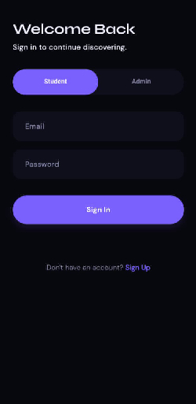
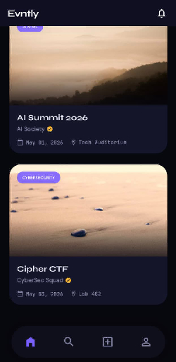
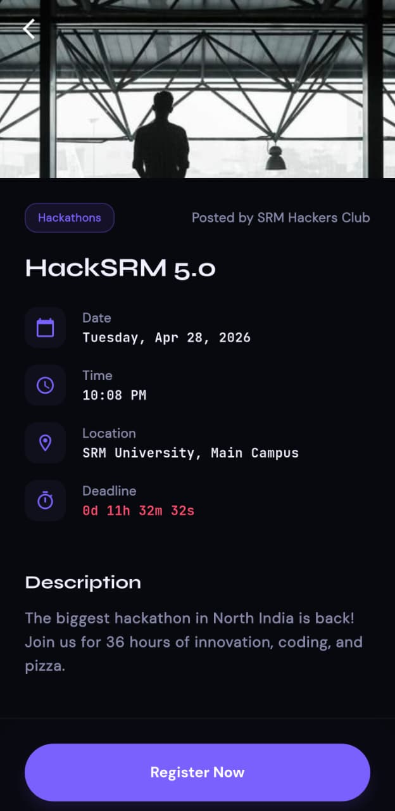
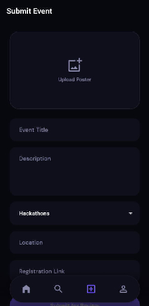
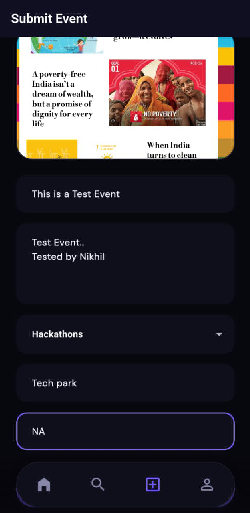
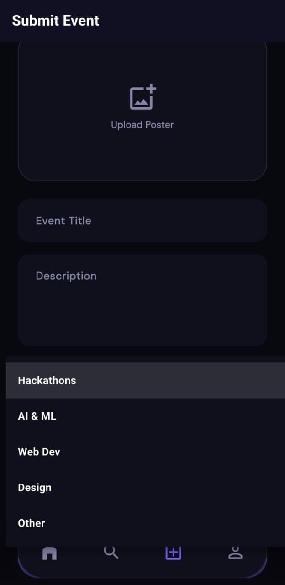
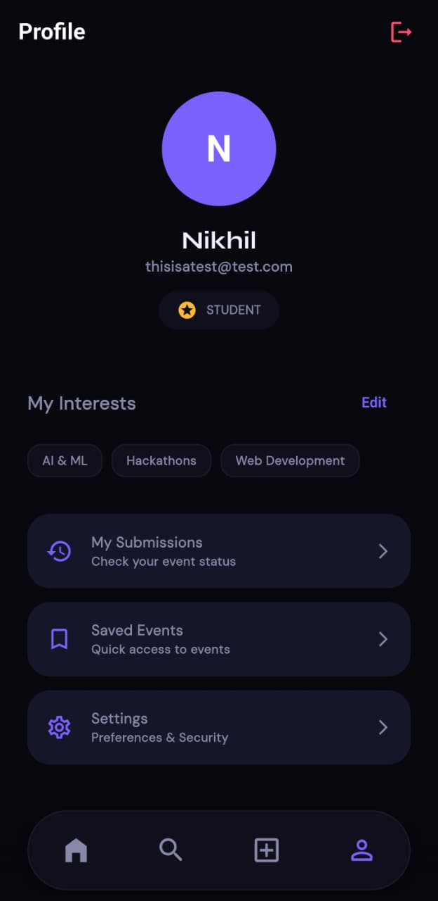
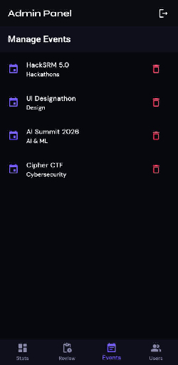

<div align="center">

# Evntly

**Never miss what matters.**

A premium campus event discovery app built with Flutter & Firebase.

[](https://flutter.dev)
[](https://firebase.google.com)
[](https://dart.dev)
[](LICENSE)
[]()

<br/>

> Built this because I kept losing hackathon links the night before the deadline.

<br/>

[Features](#features) · [Screenshots](#screenshots) · [Getting Started](#getting-started) · [How It Works](#how-it-works) · [Roadmap](#roadmap)

</div>

---

## The Problem

Every college has events — hackathons, workshops, CTFs, design sprints, speaker sessions.
But they're scattered everywhere. Instagram stories that expire. WhatsApp forwards you miss.
Notice boards nobody reads.

You find out about the coolest hackathon two hours after registration closed.

**Evntly fixes that.**

---

## Features

### For Students
- 🏠 &nbsp;**Home Feed** — events ranked by your interests, not chronological noise
- 🔍 &nbsp;**Explore** — every event on campus, filterable by category
- ❤️ &nbsp;**Save Events** — bookmark anything, access it anytime
- ⏰ &nbsp;**Live Countdowns** — know exactly when a deadline closes, down to the second
- 📤 &nbsp;**Share** — send events directly to friends
- ➕ &nbsp;**Submit Events** — anyone can submit, admin reviews before it goes live

### For Organizers
- ✅ &nbsp;Verified organizer badge on your profile
- 📊 &nbsp;Track your submission status in real time
- 📬 &nbsp;Get notified instantly on approval or rejection

### For Admins
- 🛡️ &nbsp;Full in-app admin panel — no separate dashboard needed
- 📋 &nbsp;Review queue with one-tap approve / reject
- 📌 &nbsp;Pin events to the featured carousel
- 👥 &nbsp;User management — upgrade students to organizers, ban accounts
- ⚡ &nbsp;Direct publish — admin-created events go live immediately

---

## Screenshots

<div align="center">

<table>
  <tr>
    <td align="center"><b>Login</b></td>
    <td align="center"><b>Home Feed</b></td>
    <td align="center"><b>Event Detail</b></td>
  </tr>
  <tr>
    <td></td>
    <td></td>
    <td></td>
  </tr>
  <tr>
    <td align="center"><b>Event Detail (scrolled)</b></td>
    <td align="center"><b>Submit Event</b></td>
    <td align="center"><b>Submit (filled)</b></td>
  </tr>
  <tr>
    <td></td>
    <td></td>
    <td></td>
  </tr>
  <tr>
    <td align="center"><b>Category Dropdown</b></td>
    <td align="center"><b>Profile</b></td>
    <td align="center"><b>Admin Panel</b></td>
  </tr>
  <tr>
    <td></td>
    <td></td>
    <td></td>
  </tr>
</table>

</div>

---

## How It Works
Student submits event
↓
Lands in admin review queue (not live yet)
↓
Admin previews → Approve or Reject
↓
Approved → instantly live in the main feed
Rejected → submitter notified with reason

No event goes live without being reviewed.
Keeps the feed clean and trustworthy.

---

## Getting Started

### Prerequisites
- Flutter SDK `>=3.0.0`
- Firebase project (Auth + Firestore + Storage + FCM)
- Android Studio or Xcode

### Setup

```bash
# clone the repo
git clone https://github.com/n4rnikhil/evntly.git
cd evntly

# install dependencies
flutter pub get
```

Add your Firebase config files:
android/app/google-services.json
ios/Runner/GoogleService-Info.plist

Run the app:
```bash
flutter run
```

---

## Architecture
lib/
├── main.dart               # entry point
├── theme.dart              # design system — colors, fonts, components
├── router.dart             # all routes + role-based navigation guards
├── models/                 # data models (Event, User)
├── services/               # Firebase interaction layer
├── providers/              # Riverpod state management
├── screens/                # all screens
│   └── admin/              # admin-only screens
└── widgets/                # reusable components

**State management:** Riverpod  
**Navigation:** GoRouter with role-based redirect guards  
**Backend:** Firebase (Firestore real-time streams)  
**Images:** Firebase Storage + cached_network_image  

---

## Firestore Structure
users/{uid}
name, email, role, interests[], savedEvents[],
isVerifiedOrganizer, isBanned, createdAt
events/{id}                    ← live published events
title, description, category,
date, lastDateToRegister,
location, registrationLink,
imageUrl, isFeatured, submittedBy
pending_events/{id}            ← awaiting admin review
(same as events)

status, rejectionReason, submittedAt


---

## What I Learned

- Designing a role-based auth system from scratch with Firebase
- Real-time data syncing with Firestore streams
- Making Flutter animations feel genuinely smooth and native
- Building an admin panel inside a mobile app
- Thinking about UX from the perspective of someone who actually uses the thing daily

---

## Contributing

This started as a personal project but I'd love to see it grow.  
If you have ideas, open an issue. If you want to build something, open a PR.

---

## License

Distributed under the MIT License. See [LICENSE](LICENSE) for more information.

---

<div align="center">

Made with way too much coffee by **Nik**

<br/>

⭐ Star this repo if it helped you or if you just think it's cool

</div>
